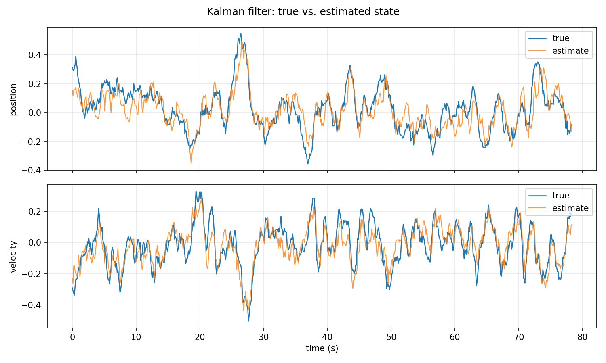

# ROS2 1D Altitude-Channel GNC Pipeline (Kalman Filter + LQR)

A three-node ROS2 (rclcpp) closed-loop simulation demonstrating state estimation
and LQR control of a simplified 1D quadrotor altitude channel.

**Scope note:** this started as a discrete-time double-integrator testbed and has
now been extended to a physically meaningful vertical thrust model. It is still
not full quadrotor dynamics, but a clean, validated subsystem for developing
ROS2 estimation/control architecture and aerospace control concepts before
moving toward attitude dynamics and Gazebo.

## System

State: `x = [position, velocity]ᵀ`. The vertical dynamics are:

```text
m*z_ddot = T - m*g
```

where `T` is actual thrust in newtons, `m` is vehicle mass, and `g` is gravity.

With `dt = 0.1 s`, the discrete-time plant is:

```text
x(k+1) = A x(k) + B T(k) + g_vec + w(k)

B     = [0.0    ]
        [dt / m ]

g_vec = [0.0     ]
        [-g*dt   ]
```

The constant gravity term makes the physical model affine rather than a purely
linear `A*x + B*u` model.

Process noise `Q = 0.001·I` and measurement noise `R = 0.05·I` are injected in
`plant_node` and correlated through Cholesky factorization, allowing
non-diagonal covariances if extended later.

### Kalman filter (predict/update)

The estimator keeps the existing linear KF formulation around the hover trim.
The actual thrust is converted to the equivalent deviation input:

```text
u_KF = T - m*g
```

The filter then uses:

```text
Predict:  x_hat^- = A x_hat + B u_KF          P^- = A P Aᵀ + Q

Update:   y = z - C x_hat^-                  S = C P^- Cᵀ + R
          K = P^- Cᵀ S⁻¹                     (solved via LDLT, not an explicit inverse)
          x_hat = x_hat^- + K y              P = (I - K C) P^-
```

This keeps the estimator linear around the hover operating point while the
plant uses the physically meaningful thrust/gravity model.

### LQR controller

The LQR feedback term remains:

```text
u_fb = -K(x_hat - x_ref)
```

Because hover requires nonzero thrust, the controller adds a trim/feedforward
term:

```text
T_trim = m*g
T_raw  = T_trim + u_fb
       = m*g + u_fb
```

The actuator command is then saturated to a physical range:

```text
T_cmd = clamp(T_raw, 0, T_max)
```

The LQR gain `K`, physical parameters, and thrust limit are configurable through
ROS2 parameters rather than hardcoded values.

## Architecture

```text
plant_node ──(measurement)──► estimator_node ──(estimated_state)──► controller_node
     │                                                                     │
     ├──(true_state, ground truth only)                                    │
     ▲                                                                     │
     └──────────────────────────(control: thrust T)────────────────────────┘
```

`true_state` is published purely for offline validation (logging/plotting) —
it is never subscribed to by `estimator_node` or `controller_node`.

Control flow inside `controller_node` is:

```text
estimated state
      │
      ▼
     LQR
      │
      ▼
    u_fb
      │
      +---- m*g
      │
      ▼
    T_raw
      │
      ▼
 saturation
      │
      ▼
    T_cmd
```

Each node runs on the default single-threaded executor. `plant_node` steps the
true state on a 10 Hz wall timer, while `estimator_node` predicts/updates on
each incoming measurement using the most recently received thrust command.

**Known limitation:** the loop implicitly assumes approximately synchronized
10 Hz execution with no message loss or significant jitter. There is no
independent timer driving the KF predict step and no timestamp-based `dt`
handling yet. A more realistic implementation would explicitly handle
asynchronous timing and measured timestamps.

## Configuration

ROS2 parameters are used for the plant, estimator, and controller.

```text
config/
├── plant_params.yaml
├── estimator_params.yaml
└── controller_params.yaml
```

Important parameters include:

```text
mass
gravity
dt
max_thrust
A
C
Q
R
P0
x0
K_gain
```

The thrust-input matrix `B` is derived from `dt` and `mass` rather than being
kept as an independent physical parameter.

Override the LQR gain from the CLI without editing YAML, e.g.:

```bash
ros2 run quadrotor_gnc controller_node --ros-args -p K_gain:="[3.0, 2.8]"
```

## Build & run

```bash
cd ~/quadrotor_ws
colcon build --symlink-install --packages-select quadrotor_gnc
source install/setup.bash
ros2 launch quadrotor_gnc gnc.launch.py
```

## Testing

Unit tests cover `LQRController` in isolation (no ROS dependency):

```bash
colcon test --packages-select quadrotor_gnc
colcon test-result --verbose
```

## Validation

The repository includes `scripts/analyze_bag.py` for offline comparison of the
estimated state against the plant's ground truth.

Record a validation run with:

```bash
ros2 bag record -o long_run_bag /true_state /estimated_state /control
```

Analyze the bag with:

```bash
cd ~/quadrotor_ws/scripts
python3 analyze_bag.py ../long_run_bag
```

The recorded `true_state` is ground truth for validation only; it is never seen
by the estimator or controller.

## Results



Phase 1 was validated against ground truth over a 78.3 s run with 724 matched
state samples.

### Estimation error

| Window | Position RMSE | Position mean error | Velocity RMSE | Velocity mean error |
|---|---:|---:|---:|---:|
| Transient (t < 5 s) | 0.0982 | 0.0463 | 0.0755 | 0.0234 |
| Steady-state (t >= 5 s) | 0.0872 | 0.0028 | 0.0736 | 0.0026 |

The steady-state mean errors are close to zero, while the estimated position
and velocity track the true state throughout the validation run without
divergence.

The transient error is larger because the estimator starts from an initial
state that differs from the plant's initial state and then converges as
measurements are incorporated.

The validation demonstrates consistency between:

```text
physical plant:
m*z_ddot = T - mg

controller:
T = mg + u_fb

estimator:
u_KF = T - mg
```

**Observed limitation:** with the current process/measurement noise settings,
the estimate still smooths some fast excursions of the true state. This is
expected from the chosen `Q`/`R` balance and can be retuned in
`estimator_params.yaml`; rerun the bag capture and `analyze_bag.py` after
changing those parameters.

## Repo structure

```text
quadrotor_gnc/
├── include/quadrotor_gnc/     # kalman_filter.hpp, lqr_controller.hpp
├── src/                       # node + library implementations
├── launch/                    # gnc.launch.py
├── config/                    # YAML params
├── msg/                       # Measurement, EstimatedState, Control
├── test/                      # gtest for LQRController
├── scripts/                   # analyze_bag.py: RMSE + true-vs-estimate plot
├── kf_results.png             # latest Phase 1 validation plot
├── CMakeLists.txt
├── package.xml
├── LICENSE
└── .gitignore
```

## Next steps

- Add a second, decoupled attitude channel (roll/pitch) and validate the
  combined altitude + attitude architecture with the same bag/RMSE workflow.
- Integrate with Gazebo: bridge sensor/actuator topics via `ros_gz_bridge`,
  then replace `plant_node` with an actual simulated quadrotor as the plant.
- Move from decoupled linear channels toward full 6DOF nonlinear quadrotor
  dynamics.
- Develop an EKF for nonlinear state estimation.
- Build a cascaded position → attitude → motor-mixer controller.
